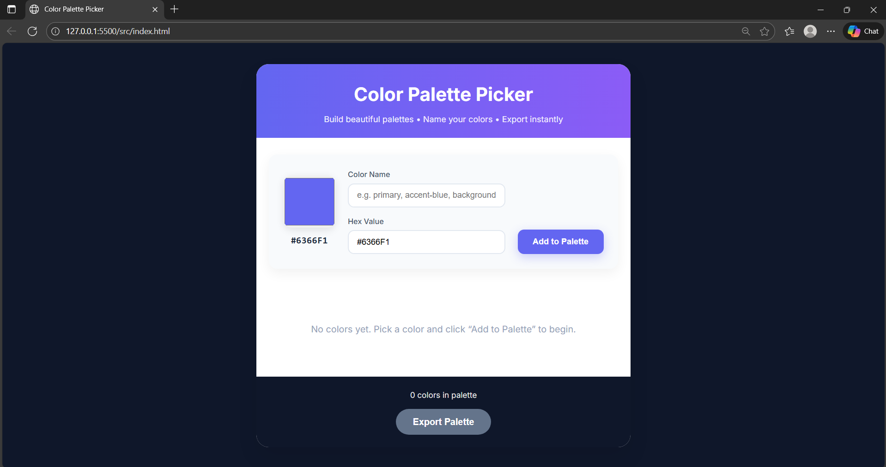
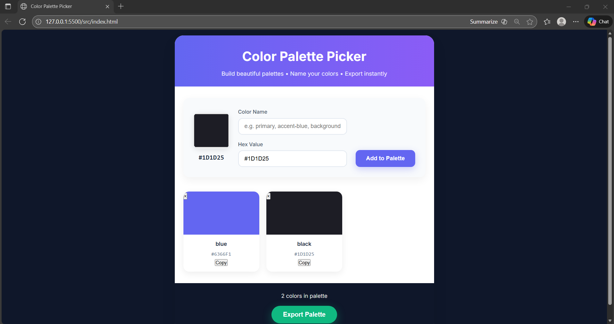
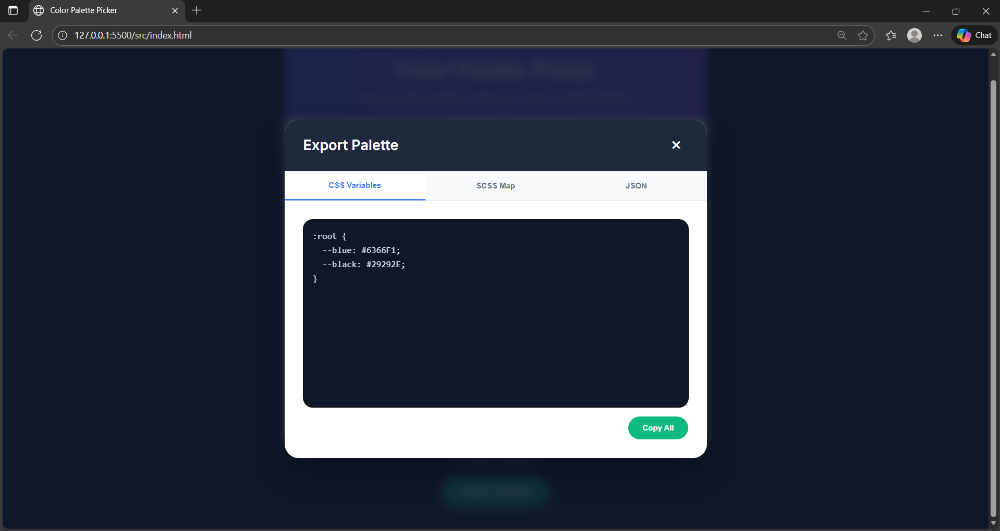

# Color Palette Picker

A beautiful, minimalist, single-purpose web app that lets you **pick, name, and export color palettes** instantly — perfect for designers, developers, and anyone who hates copying hex codes manually.

Built as part of **AI for Bharat – Week 1: Micro-Tools** using **Kiro-powered development**.

Live Demo: https://your-username.github.io/color-palette-picker  
(Replace with your actual GitHub Pages link)

## Features

- Pick colors using native color picker or paste hex codes  
- Give meaningful names to colors (`primary`, `accent-blue`, `error`, etc.)  
- Click any color card to copy HEX or CSS variable (`--primary`)  
- Delete colors with one click  
- Export palette in 3 formats via a stunning modal:
  - **CSS Custom Properties** (`:root { ... }`)
  - **SCSS Map** (`$palette: ( ... );`)
  - **JSON** (for design systems or tools)
- Real-time toast feedback on copy  
- Fully responsive & mobile-friendly  
- Zero dependencies · Pure vanilla JS + ES6 modules  

## Screenshots




## How to Run Locally

```bash
# 1. Clone the repo
git clone [https://github.com/your-username/color-palette-picker.git](https://github.com/AdityaKarippadathUdai/color-palette)

# 2. Open the src folder
cd color-palette-picker/src

# 3. Open index.html in your browser (double-click or use Live Server)
open index.html
